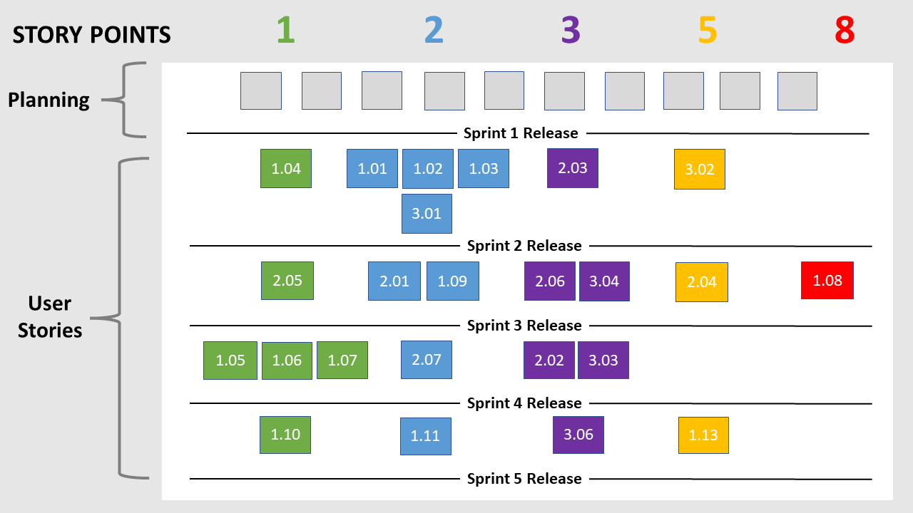

# Project Management
This page provides a general overview of the assigned tasks and roles for the duration of five sprints.

--------------------------------

## Story Map

--------------------------------

## Project Plan

#### Sprint 1

  

 
<i>Due: January 28,  8:00pm </i>
 
<i>Demo: January 30 </i>
  
<b>Estimated Sprint Velocity: 0</b>
 
 
<h4>User Stories</h4>
<table>
    <tr>
        <th>User Story</th>
        <th>Story Points</th>
    </tr>
</table>
  
<h4> Tasks </h4>

<table>
    <tr>
        <th>Task</th>
        <th>Related US</th>
        <th>Assigned To</th>
        <th>Due Date</th>
    </tr>
    <tr>
        <td>Finish user stories - acceptance tests, complexity points, MoSCoW</td>
        <td>Documentation</td>
        <td>Qasim</td>
        <td>Jan 25</td>
    </tr>
    <tr>
        <td>Glossary</td>
        <td>Documentation</td>
        <td>Vinay</td>
        <td>Jan 25</td>
    </tr>
    <tr>
        <td>Technical resources</td>
        <td>Documentation</td>
        <td>Vinay, Xiding</td>
        <td>Jan 25</td>
    </tr>
    <tr>
        <td>Similar products and analysis, open source projects</td>
        <td>Documentation</td>
        <td>Vinay Xiding</td>
        <td>Jan 25</td>
    </tr>
    <tr>
        <td>Architecture diagram</td>
        <td>Documentation</td>
        <td>Ian</td>
        <td>Jan 25</td>
    </tr>
    <tr>
        <td>UML class diagram</td>
        <td>Documentation</td>
        <td>Ian, Qasim</td>
        <td>Jan 25</td>
    </tr>
    <tr>
        <td>UML sequence diagram</td>
        <td>Documentation</td>
        <td>Aryan</td>
        <td>Jan 25</td>
    </tr>
    <tr>
        <td>Low-fidelity UI diagram</td>
        <td>Documentation</td>
        <td>Jesse, Aryan, Ian</td>
        <td>Jan 25</td>
    </tr>
    <tr>
        <td>Team canvas and team roles (belbin, scrum)</td>
        <td>Documentation</td>
        <td>Jesse</td>
        <td>Jan 25</td>
    </tr>
    <tr>
        <td>Story Map and project plan</td>
        <td>Documentation</td>
        <td>Jesse</td>
        <td>Jan 26</td>
    </tr>
    <tr>
        <td>Convert google docs to mkdocs and deploy to github.io pages</td>
        <td>Documentation</td>
        <td>Jesse</td>
        <td>Jan 27</td>
    </tr>
    <tr>
        <td>Set up minimal backend code</td>
        <td>Setup</td>
        <td>Qasim, Xiding</td>
        <td>Jan 30</td>
    </tr>

</table>

#### Sprint 2

 

 
<i>Due: February 11,  8:00pm</i>
 
<i>Demo: February 13</i>
  
<b>Estimated Sprint Velocity: 17</b>
 
 
<h4>User Stories</h4>
<table>
    <tr>
        <th>User Story</th>
        <th>Story Points</th>
    </tr>
    <tr>
        <td>US 1.01 - Add new children</td>
        <td>2</td>
    </tr>
    <tr>
        <td>US 1.02 - Add new parents</td>
        <td>2</td>
    </tr>
    <tr>
        <td>US 1.03 - Add new daycare workers</td>
        <td>2</td>
    </tr>
    <tr>
        <td>US 1.04 - Generate credentials</td>
        <td>1</td>
    </tr>
    <tr>
        <td>US 3.01 - Parent Login</td>
        <td>2</td>
    </tr>
    <tr>
        <td>US 2.03 - Add new activity </td>
        <td>3</td>
    </tr>
    <tr>
        <td>US 3.02 - View child’s feed</td>
        <td>5</td>
    </tr>
</table>
  
<h4> Tasks</h4>
<table>
    <tr>
        <th>Task</th>
        <th>Related US</th>
        <th>Assigned To</th>
        <th>Due Date</th>
    </tr>
    <tr>
        <td>Set up databse</td>
        <td>Setup</td>
        <td>Qasim</td>
        <td>Jan 31</td>
    </tr>
    <tr>
        <td>Set up backend code</td>
        <td>Setup</td>
        <td>Xiding</td>
        <td>Jan 31</td>
    </tr>
    <tr>
        <td>Create tables for admin site</td>
        <td>1.01, 1.02, 1.03</td>
        <td>Xiding, Qasim</td>
        <td>Feb 1</td>
    </tr>
    <tr>
        <td>Create a secure automatic credentials generator</td>
        <td>1.04</td>
        <td>Qasim</td>
        <td>Feb 3</td>
    </tr>
    <tr>
        <td>Set up REST endpoints for getting and posting activities</td>
        <td>Setup</td>
        <td>Qasim, Xiding</td>
        <td>Feb 4</td>
    </tr>
    <tr>
        <td>Simple UI for parent login and home page</td>
        <td>3.01</td>
        <td>Vinay</td>
        <td>Feb 4</td>
    </tr>
    <tr>
        <td>Simple menu bar UI</td>
        <td>2.03, 3.02</td>
        <td>Ian</td>
        <td>Feb 4</td>
    </tr>
    <tr>
        <td>Simple add activity page UI</td>
        <td>2.03</td>
        <td>Jesse</td>
        <td>Feb 4</td>
    </tr>
    <tr>
        <td>Simple activity feed UI</td>
        <td>3.02</td>
        <td>Aryan</td>
        <td>Feb 4</td>
    </tr>
    <tr>
        <td>Parent login logic</td>
        <td>3.01</td>
        <td>Vinay</td>
        <td>Feb 8</td>
    </tr>
    <tr>
        <td>Menu bar links for page switching</td>
        <td>Setup</td>
        <td>Ian</td>
        <td>Feb 8</td>
    </tr>
    <tr>
        <td>Add activity logic</td>
        <td>2.03</td>
        <td>Jesse</td>
        <td>Feb 8</td>
    </tr>
    <tr>
        <td>Populate feed with activities (feed logic)</td>
        <td>3.02</td>
        <td>Aryan</td>
        <td>Feb 8</td>
    </tr>
    <tr>
        <td>Set up deployment</td>
        <td>Setup</td>
        <td>Qasim</td>
        <td>Feb 8</td>
    </tr>
    <tr>
        <td>Github actions for testing</td>
        <td>Setup</td>
        <td>Xiding</td>
        <td>Feb 8</td>
    </tr>
    <tr>
        <td>Tests for parent login</td>
        <td>3.01</td>
        <td>Vinay, Xiding</td>
        <td>Feb 10</td>
    </tr>
    <tr>
        <td>Tests for adding users</td>
        <td>1.01, 1.02, 1.03</td>
        <td>Ian, Xiding</td>
        <td>Feb 10</td>
    </tr>
    <tr>
        <td>Tests for adding an activity</td>
        <td>2.03</td>
        <td>Jesse, Qasim</td>
        <td>Feb 10</td>
    </tr>
    <tr>
        <td>Tests for activities appearing on feed</td>
        <td>3.02</td>
        <td>Aryan, Qasim</td>
        <td>Feb 10</td>
    </tr>
    <tr>
        <td>Meet with client to review Sprint 2 deliverables</td>
        <td>Delivery</td>
        <td>All</td>
        <td>Feb 10</td>
    </tr>
    <tr>
        <td>Make necessary changes based on client's feedback</td>
        <td>Delivery</td>
        <td>All</td>
        <td>Feb 11</td>
    </tr>
    <tr>
        <td>Revise documentation pages and story map based on feedback</td>
        <td>Documentation</td>
        <td>Jesse</td>
        <td>Feb 11</td>
    </tr>
    <tr>
        <td>Update Sprint 3 planning in Project Plan</td>
        <td>Documentation</td>
        <td>Jesse</td>
        <td>Feb 11</td>
    </tr>
    <tr>
        <td>Update UML class diagram based on codebase</td>
        <td>Documentation</td>
        <td>Ian</td>
        <td>Feb 11</td>
    </tr>
    <tr>
        <td>Update UML sequence diagram based on codebase</td>
        <td>Documentation</td>
        <td>Aryan</td>
        <td>Feb 11</td>
    </tr>
    <tr>
        <td>Update architecture diagram based on feedback</td>
        <td>Documentation</td>
        <td>Ian</td>
        <td>Feb 11</td>
    </tr>
    <tr>
        <td>Update low-fidelity UI diagram based on feedback</td>
        <td>Documentation</td>
        <td>Jesse, Aryan</td>
        <td>Feb 11</td>
    </tr>
    <tr>
        <td>Revise technical resources based on feedback (add cybera, add comments for open-source projects)</td>
        <td>Documentation</td>
        <td>Vinay, Xiding</td>
        <td>Feb 11</td>
    </tr>

</table>

#### Sprint 3

 

 
<i>Due: March 4,  8:00pm</i>
 
<i>Demo: March 6</i>
  
<b>Estimated Sprint Velocity: 27</b>
 
 
<h4>User Stories</h4>
<table>
    <tr>
        <th>User Story</th>
        <th>Story Points</th>
    </tr>
    <tr>
        <td>US 2.01 - Daycare worker Login</td>
        <td>2</td>
    </tr>
    <tr>
        <td>US 1.09 - Assign children to a daycare worker</td>
        <td>2</td>
    </tr>
    <tr>
        <td>US 2.04 - Upload photo and videos</td>
        <td>5</td>
    </tr>
    <tr>
        <td>US 2.05 - Add description to activity</td>
        <td>1</td>
    </tr>
    <tr>
        <td>US 1.08 - View feeds for all children</td>
        <td>8</td>
    </tr>
    <tr>
        <td>US 2.06 - Send messages to parents</td>
        <td>3</td>
    </tr>
    <tr>
        <td>US 3.04 - Send messages to worker</td>
        <td>3</td>
    </tr>
    <tr>
        <td>US 2.08 - Tag children with sharing permission</td>
        <td>3</td>
    </tr>
</table>
  
<h4>Tasks</h4>
<table>
    <tr>
        <th>Task</th>
        <th>Related US</th>
        <th>Assigned To</th>
        <th>Due Date</th>
    </tr>
    <tr>
        <td>Authenticate worker credentials</td>
        <td>US 2.01</td>
        <td>Lewis(Xiding)</td>
        <td>Feb 17</td>
    </tr>
    <tr>
        <td>Create POST request to send worker login info</td>
        <td>US 2.01</td>
        <td>Vinay</td>
        <td>Feb 17</td>
    </tr>
    <tr>
        <td> Create easy way for management users to assign a worker to a child</td>
        <td>US 1.09</td>
        <td>Lewis(Xiding)</td>
        <td>Feb 17</td>
    </tr>
    <tr>
        <td> Filter child list to only show children that are assigned to that worker</td>
        <td>US 1.09</td>
        <td>Jesse</td>
        <td>Feb 17</td>
    </tr>
    <tr>
        <td>Store description in the new activity that has been sent through a post request</td>
        <td>US 2.05</td>
        <td>Qasim</td>
        <td>Feb 17</td>
    </tr>
    <tr>
        <td>Get description from text input and send within the activity post request</td>
        <td>US 2.05</td>
        <td>Ian</td>
        <td>Feb 17</td>
    </tr>
    <tr>
        <td>Create success and erro messages throughout app (such as login, add activity, etc)</td>
        <td>Delivery</td>
        <td>Ian</td>
        <td>Feb 17</td>
    </tr>
    <tr>
        <td>Create section for activities to appear in admin dashboard, separated by daycare worker</td>
        <td>US 1.08</td>
        <td>Lewis(Xiding)</td>
        <td>Feb 17</td>
    </tr>
    <tr>
        <td>Generate feeds for each daycare worker - all activities for children in their group should appear, without duplicates</td>
        <td>US 1.08</td>
        <td>Qasim</td>
        <td>Feb 17</td>
    </tr>
    <tr>
        <td>Refactor database to include messages</td>
        <td>US 2.06, US 3.04</td>
        <td>Lewis(Xiding)</td>
        <td>Feb 17</td>
    </tr>
    <tr>
        <td>Enable camera function to take photos and videos</td>
        <td>US 2.04</td>
        <td>Aryan</td>
        <td>Feb 17</td>
    </tr>
    <tr>
        <td> Only allow children to be tagged in group posts if they have allowed permissions</td>
        <td>US 2.08</td>
        <td>Jesse</td>
        <td>Feb 17</td>
    </tr>
    <tr>
        <td>Create UI for message page (both worker and parent interface)</td>
        <td>US 2.06, US 3.04</td>
        <td>Vinay, Aryan</td>
        <td>Feb 17</td>
    </tr>
    <tr>
        <td>Send the photo/video within the activity post request</td>
        <td>US 2.04</td>
        <td>Jesse</td>
        <td>Feb 27</td>
    </tr>
    <tr>
        <td>Compress photo/video if needed</td>
        <td>US 2.04</td>
        <td>Jesse</td>
        <td>Feb 27</td>
    </tr>
    <tr>
        <td>Create endpoints for posting a new message for both parent and worker</td>
        <td>US 2.06, US 3.04</td>
        <td>Qasim</td>
        <td>Feb 27</td>
    </tr>
    <tr>
        <td>Create separate file for parent menu bar and have working links for pages, change redirect from login (mimic worker login and menubar redirect)</td>
        <td>US 3.04</td>
        <td>Ian</td>
        <td>Feb 27</td>
    </tr>
    <tr>
        <td>Store photo/video in the new activity that has been sent through a post request</td>
        <td>US 2.04</td>
        <td>Lewis(Xiding)</td>
        <td>March 1</td>
    </tr>
    <tr>
        <td>Create post requests for new messages sent from parents or workers</td>
        <td>US 2.06, US 3.04</td>
        <td>Vinay, Aryan</td>
        <td>March 1</td>
    </tr>
    <tr>
        <td>Auto refresh (or refresh button) for messaging page so new messages are seen as they are recieved/created</td>
        <td>US 2.06, US 3.04</td>
        <td>Ian</td>
        <td>March 3</td>
    </tr>
    <tr>
        <td>Auto refresh (or refresh button) for parent feed page so new activities are seen as they are created</td>
        <td>US 2.06, US 3.04</td>
        <td>Ian</td>
        <td>March 3</td>
    </tr>
</table>

#### Sprint 4

 

 
<i>Due: March 18,  8:00pm</i>
 
<i>Demo: March 20</i>
  
<b>Estimated Sprint Velocity: 8</b>
 
 
<h4> User Stories </h4>
<table>
    <tr>
        <th>User Story</th>
        <th>Story Points</th>
    </tr>
    <tr>
        <td>US 2.02 - Take attendance</td>
        <td>3</td>
    </tr>
        <tr>
        <td>US 2.07 - Add activities to day plan</td>
        <td>2</td>
    </tr>
        <tr>
        <td>US 1.05 - Delete existing children</td>
        <td>1</td>
    </tr>
        <tr>
        <td>US 1.06 - Delete existing parents</td>
        <td>1</td>
    </tr>
        <tr>
        <td>US 1.07 - Delete existing workers</td>
        <td>1</td>
    </tr>
</table>
  
<h4>Tasks</h4>
<table>
    <tr>
        <th>Task</th>
        <th>Related US</th>
        <th>Assigned To</th>
        <th>Due Date</th>
    </tr>
    <tr>
        <td>Delete functionality on admin site</td>
        <td>US 1.05, 1.06, 1.07</td>
        <td>Lewis (Xiding)</td>
        <td>March 10</td>
    </tr>
    <tr>
        <td>Attendance models for backend</td>
        <td>US 2.02</td>
        <td>Qasim</td>
        <td>March 10</td>
    </tr>
    <tr>
        <td>Attendance post, get requests</td>
        <td>US 2.02</td>
        <td>Qasim</td>
        <td>March 15</td>
    </tr>
    <tr>
        <td>Attendance backend tests</td>
        <td>US 2.02</td>
        <td>Qasim</td>
        <td>March 18</td>
    </tr>
    <tr>
        <td>Dayplan activity models for backend</td>
        <td>US 2.02</td>
        <td>Lewis (Xiding)</td>
        <td>March 10</td>
    </tr>
    <tr>
        <td>Dayplan activity post, get requests</td>
        <td>US 2.02</td>
        <td>Lewis (Xiding)</td>
        <td>March 15</td>
    </tr>
    <tr>
        <td>Dayplan activity backend tests</td>
        <td>US 2.02</td>
        <td>Lewis (Xiding)</td>
        <td>March 18</td>
    </tr>
    <tr>
        <td>Attendance page UI</td>
        <td>US 2.02</td>
        <td>Vinay</td>
        <td>March 10</td>
    </tr>
    <tr>
        <td>Attendance page logic and api requests</td>
        <td>US 2.02</td>
        <td>Vinay, Ian</td>
        <td>March 15</td>
    </tr>
    <tr>
        <td>Attendance page tests</td>
        <td>US 2.02</td>
        <td>Vinay, Jesse</td>
        <td>March 18</td>
    </tr>
    <tr>
        <td>Send push notifications to parent when new activity is created</td>
        <td>US 3.03</td>
        <td>Ian</td>
        <td>March 15</td>
    </tr>
    <tr>
        <td>Add ability for daycareWorker to edit an activity</td>
        <td>US 2.02</td>
        <td>Jesse</td>
        <td>March 10</td>
    </tr>
    <tr>
        <td>Create attendance "check in" activties for feed</td>
        <td>US 2.02</td>
        <td>Jesse</td>
        <td>March 18</td>
    </tr>
    <tr>
        <td>Dayplan page UI - including switch between days, and add new item to current/future days</td>
        <td>US 2.07</td>
        <td>Aryan</td>
        <td>March 13</td>
    </tr>
    <tr>
        <td>Dayplan activity post/get requests for dayplan page</td>
        <td>US 2.07</td>
        <td>Aryan, Ian</td>
        <td>March 13</td>
    </tr>
    <tr>
        <td>Dayplan activity items for add activity page dropdown</td>
        <td>US 2.07</td>
        <td>Jesse</td>
        <td>March 15</td>
    </tr>
    <tr>
        <td>Dayplan page tests</td>
        <td>US 2.07</td>
        <td>Aryan, Jesse</td>
        <td>March 18</td>
    </tr>
</table>

#### Sprint 5

 
<i>Due: April 4,  8:00pm</i>
 
<i>Demo: April 5</i>
  
<b>Estimated Sprint Velocity: 10</b>
 
 
<h4>User Stories</h4>
<table>
    <tr>
        <th>User Story</th>
        <th>Story Points</th>
    </tr>
    <tr>
        <td>US 3.03 - Receive Notifications</td>
        <td>3</td>
    </tr>
    <tr>
        <td>US 1.10 - View plans and prices</td>
        <td>1</td>
    </tr>
    <tr>
        <td>US 3.06 - View child’s dayplan</td>
        <td>3</td>
    </tr>
    <tr>
        <td>US 1.13 - Edit existing users</td>
        <td>1</td>
    </tr>
    <tr>
        <td>US 1.11 - Assign multiple children to a parent</td>
        <td>2</td>
    </tr>
</table>
  

<h4>Tasks</h4>
<table>
    <tr>
        <th>Task</th>
        <th>Related US</th>
        <th>Assigned To</th>
        <th>Due Date</th>
    </tr>
    <tr>
        <td>Change existing requests to accomodate multiple children assigned to one parent</td>
        <td>US 1.11</td>
        <td>Qasim</td>
        <td>March 26</td>
    </tr>
    <tr>
        <td>Patch requests for user settings - parent, child, worker</td>
        <td>Delivery</td>
        <td>Qasim</td>
        <td>March 26</td>
    </tr>
    <tr>
        <td>Static page for plans and prices on admin site</td>
        <td>US 1.10</td>
        <td>Qasim</td>
        <td>April 2</td>
    </tr>
    <tr>
        <td>Deployment Instructions</td>
        <td>Final Documentation</td>
        <td>Qasim</td>
        <td>April 2</td>
    </tr>
    <tr>
        <td>Allow for editing existing users on admin site</td>
        <td>US 1.13</td>
        <td>Lewis</td>
        <td>March 26</td>
    </tr>
    <tr>
        <td>CD/CI runner on Github/Cybera (for tests too)</td>
        <td>Delivery</td>
        <td>Lewis</td>
        <td>March 26</td>
    </tr>
    <tr>
        <td>Fix cookies on admin site</td>
        <td>Delivery</td>
        <td>Lewis</td>
        <td>April 2</td>
    </tr>
    <tr>
        <td>Add security check for requests to server</td>
        <td>Delivery</td>
        <td>Lewis</td>
        <td>April 2</td>
    </tr>
    <tr>
        <td>Add frontend tests and test quality tools</td>
        <td>Delivery</td>
        <td>Vinay, Aryan, Jesse, Ian</td>
        <td>April 2</td>
    </tr>
    <tr>
        <td>Update parent feed to display activities from multiple children</td>
        <td>1.11</td>
        <td>Vinay</td>
        <td>March 26</td>
    </tr>
    <tr>
        <td>Add documentation throughout entire app</td>
        <td>Delivery</td>
        <td>Vinay</td>
        <td>April 2</td>
    </tr>
    <tr>
        <td>Parent settings page UI - parent and child info (if extra time)</td>
        <td>Delivery</td>
        <td>Vinay</td>
        <td>April 2</td>
    </tr>
    <tr>
        <td>Improve UI throughout entire app</td>
        <td>Delivery</td>
        <td>Aryan</td>
        <td>March 26</td>
    </tr>
    <tr>
        <td>Speak to client about feedback on UI and make changes</td>
        <td>Delivery</td>
        <td>Aryan</td>
        <td>April 2</td>
    </tr>
    <tr>
        <td>Update parent messages and dayplan to include multiple workers if multiple children</td>
        <td>1.11</td>
        <td>Aryan</td>
        <td>March 26</td>
    </tr>
    <tr>
        <td>Worker settings page UI (if extra time)</td>
        <td>Delivery</td>
        <td>Aryan</td>
        <td>April 2</td>
    </tr>
    <tr>
        <td>Switch activity feed to carousel</td>
        <td>Delivery</td>
        <td>Jesse</td>
        <td>March 26</td>
    </tr>
    <tr>
        <td>More efficient worker activity feed get request</td>
        <td>Delivery</td>
        <td>Jesse</td>
        <td>March 26</td>
    </tr>
    <tr>
        <td>User Manual</td>
        <td>Final Documentation</td>
        <td>Jesse</td>
        <td>April 2</td>
    </tr>
    <tr>
        <td>Settings patch requests for parent/child and worker (if extra time)</td>
        <td>Delivery</td>
        <td>Jesse</td>
        <td>April 2</td>
    </tr>
    <tr>
        <td>Finish push notifications, notifications page</td>
        <td>3.03</td>
        <td>Ian</td>
        <td>March 26</td>
    </tr>
    <tr>
        <td>Walk through entire app with acceptance tests, fix any bugs found</td>
        <td>Delivery</td>
        <td>Ian</td>
        <td>April 2</td>
    </tr>
    <tr>
        <td>Job Description</td>
        <td>Final Documentation</td>
        <td>Ian</td>
        <td>April 2</td>
    </tr>

</table>

