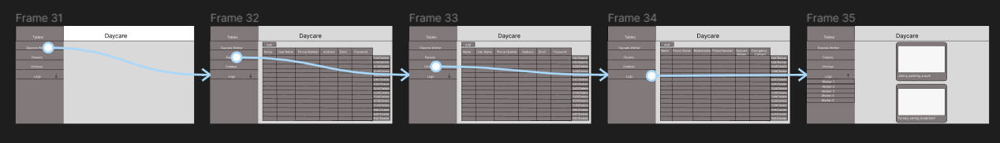
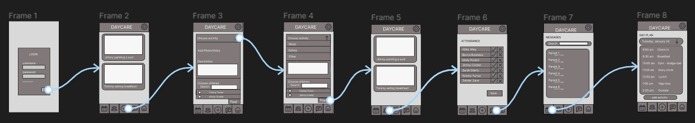
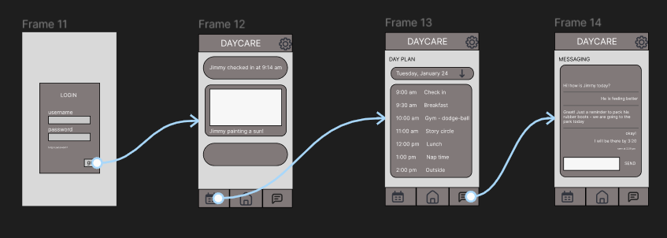

# Software Design

This page includes a short description of the overall architecture style of the system, its high-level system components, and their logical (what data they exchange) and control (how they invoke each other) dependencies.

--------------------------------
## Architecture Diagram

The architecture diagram outlines the layered flow of the applications from the database, to the back end framework, to the front end framework. It is important to separate these layers to maintain independence.

--------------------------------
## UML Class Diagram

The UML class diagram describes the most important classes within the application.

##### Backend Classes

##### Frontend classes

--------------------------------
## UML Sequence Diagrams

Multiple sequence diagrams depicting the most important scenarios.
  
<!-- users -->

##### User Diagrams
These sequence diagrams are for users of the mobile application - parents or daycare workers.

 

##### Admin Diagrams
These sequence diagrams are for users of the administration web application - only management users.

<!-- admin -->

--------------------------------
## Low-Fidelity User Interface

Since we have three types of users (daycare management, daycare workers, parents), we have three prototypes for their respective user interface. Workers and parents will be using a mobile application, while daycare management will be using a web application.

<iframe style="border: 1px solid rgba(0, 0, 0, 0.1);" width="800" height="450" src="https://www.figma.com/embed?embed_host=share&url=https%3A%2F%2Fwww.figma.com%2Ffile%2FWdNhbjD6I7osJfGGjZSw9V%2FLow-Fidelity-Prototype%3Fnode-id%3D0%253A1%26t%3DkPWiXYFslDru0COj-1" allowfullscreen></iframe>

##### Admin/Manager Interface

##### Daycare Worker Interface

##### Parent Interface

