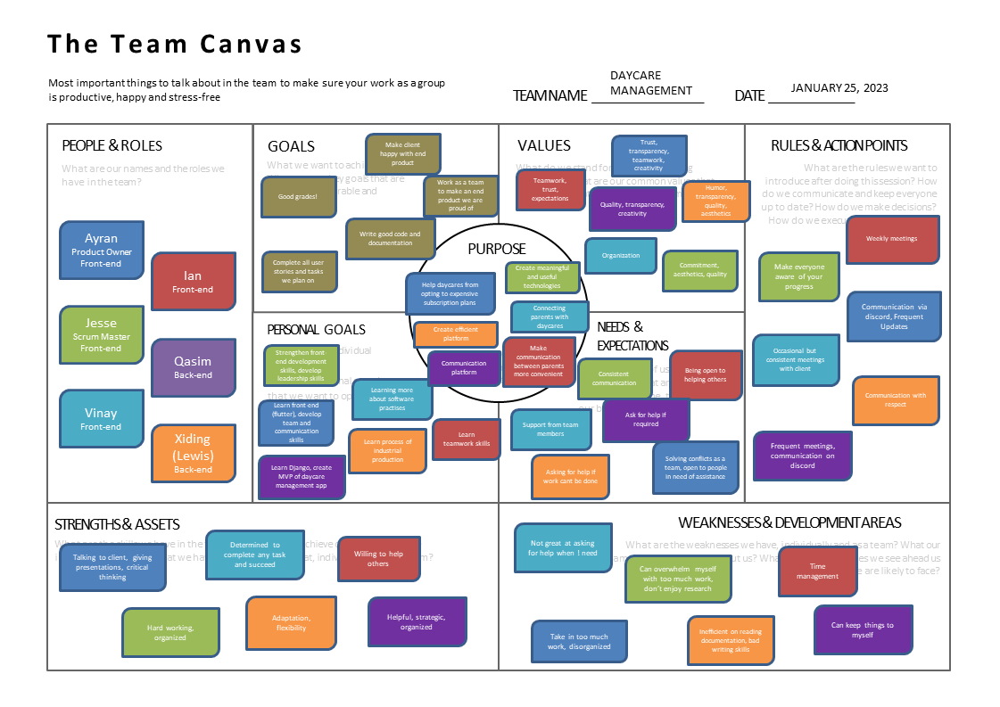

# Teamwork
This page provides an overview of the team and its members.

-----
## Team Canvas

Meet our amazing team!

-----

## Scrum Roles

 

<table>
<thead>
<tr>
<th>Sprint</th>
<th>Scrum Master</th>
<th>Product Owner</th>
<th>Team Members</th>
</tr>
</thead>
<tbody><tr>
<td>1</td>
<td>Jesse Grywacheski</td>
<td>Aryan Pramanick</td>
<td>Ian Cho 
    Qasim Muhammad Akhtar  
    Vinay Parab  
    Xiding Luo 
    </td>
</tr>
<tr>
<td>2</td>
<td>Jesse Grywacheski</td>
<td>Aryan Pramanick</td>
<td>Ian Cho  
    Qasim Muhammad Akhtar   
    Vinay Parab  
    Xiding Luo
    </td>
</tr>
<tr>
<td>3</td>
<td>Jesse Grywacheski</td>
<td>Aryan Pramanick</td>
<td>Ian Cho  
    Qasim Muhammad Akhtar  
    Vinay Parab   
    Xiding Luo
    </td>
</tr>
<tr>
<td>4</td>
<td>Jesse Grywacheski</td>
<td>Aryan Pramanick</td>
<td>Ian Cho  
    Qasim Muhammad Akhtar  
    Vinay Parab  
    Xiding Luo
    </td>
</tr>
<tr>
<td>5</td>
<td>Jesse Grywacheski</td>
<td>Aryan Pramanick</td>
<td>Ian Cho  
    Qasim Muhammad Akhtar   
    Vinay Parab   
    Xiding Luo 
    </td>
</tr>
</tbody></table>

Source: [Scrum Team Roles](https://producthq.org/career/scrum-master/scrum-master-vs-product-owner/)

 

Scrum Master

<ul>
<li><em>The Scrum Master manages the Scrum process while coordinating with the Scrum team.</em></li>
<li><em>They facilitate the development, engineering, and Scrum team by helping them improve their processes for increased efficiency.</em></li>
<li><em>Scrum Masters arrange daily stand-up meetings and facilitate other meetings, demos, and decision-making processes.</em></li>
<li><em>They also help the product owner create and maintain the product backlog. They help make the sprint backlog ready for the next sprint.</em></li>
<li><em>Scrum Masters also conduct sprint retrospective meetings and help facilitate sprint planning meetings.</em> </li>
<li><em>Roles of Scrum Masters don’t change much, but one thing always remains constant – they help remove impediments in the product process that hinder project success.</em></li>
</ul>

Product Owner

<ul>
<li><em>The product owner is the main point of contact with the client, and is the member who arranges meetings, clarifies their expectations and requirements, and ensures the product is meeting those expectations.</em></li>
<li><em>The product owner attends sprint demos, sprint planning meetings, and daily Scrums.</em></li>
<li><em>They develop the product vision, form deadlines, and define feature priorities.</em></li>
<li><em>Product owners have to fulfill their Scrum roles by continually communicating with the Scrum master.</em></li>
<li>*Product owners also help determine the right release date and contents for products</li>
<li><em>They manage the product backlog and develop it from scratch. They’re responsible for adding product backlog items, user stories, and any other necessary changes.</em></li>
<li><em>Out of the user stories, product owners define the epics and communicate them to the development team.</em></li>
<li><em>They are responsible for prioritizing the user stories with the help of team members.</em></li>
<li><em>Product owners also have to analyze and prioritize product features using sprint reviews and other similar methods.</em></li>
</ul>

--------------------------------
## Belbin

 

Source: [Belbin Team Roles](https://www.belbin.com/about/belbin-team-roles)

<table>
<thead>
<tr>
<th>Name</th>
<th>Most Suitable Roles</th>
<th>Manageable Roles</th>
<th>Least Suitable Roles</th>
</tr>
</thead>
<tbody><tr>
<td>Aryan Pramanick</td>
<td>PL, ME, RI</td>
<td>IMP, TW, CO</td>
<td>SH, CF, SP</td>
</tr>
<tr>
<td>Vinay Parab</td>
<td>SP, CF, TW</td>
<td>IMP, PL, ME</td>
<td>SH, CO, RI</td>
</tr>
<tr>
<td>Ian Cho</td>
<td>IMP, TW, RI</td>
<td>SH, CF, SP</td>
<td>CO, PL, ME</td>
</tr>
<tr>
<td>Jesse Grywacheski</td>
<td>IMP, TW, CF</td>
<td>SH, ME, SP</td>
<td>CO, PL, RI</td>
</tr>
<tr>
<td>Qasim Muhammad Akhtar</td>
<td>SP, TW, IMP</td>
<td>CF, RI, PL</td>
<td>CO, SH, ME</td>
</tr>
<tr>
<td>Xiding Luo</td>
<td>PL, TW, RI</td>
<td>IMP, CF, SP</td>
<td>ME, SH, CO</td>
</tr>
</tbody></table>

 Thinking Roles 

<strong>PL (Plant)</strong>

Tends to be highly creative and good at solving problems in unconventional ways.

<ul>
<li>Aryan Pramanick (most suitable)</li>
<li>Xiding Luo (most suitable)</li>
<li>Vinay Parab (manageable)</li>
<li>Qasim Muhammad Akhtar (manageable)</li>
</ul>

<strong>ME (Monitor Evaluator)</strong>

Provides a logical eye, making impartial judgements where required and weighs up the team&#39;s options in a dispassionate way.

<ul>
<li>Aryan Pramanick (most suitable)</li>
<li>Jesse Grywacheski (manageable)</li>
<li>Vinay Parab (manageable)</li>
</ul>

<strong>SP (Specialist)</strong>

Brings in-depth knowledge of a key area to the team.

<ul>
<li>Qasim Muhammad Akhtar (most suitable)</li>
<li>Vinay Parab (most suitable)</li>
<li>Jesse Grywacheski (manageable)</li>
<li>Ian Cho (manageable)</li>
<li>Xiding Luo (manageable)</li>
</ul>

 Action Roles 

<strong>SH (Shaper)</strong>

Provides the necessary drive to ensure that the team keeps moving and does not lose focus or momentum.

<ul>
<li>Jesse Grywacheski (manageable)</li>
<li>Ian Cho (manageable)</li>
</ul>

<strong>IMP (Implementer)</strong>

Needed to plan a workable strategy and carry it out as efficiently as possible.

<ul>
<li>Jesse Grywacheski (most suitable)</li>
<li>Ian Cho (most suitable)</li>
<li>Qasim Muhammad Akhtar (most suitable)</li>
<li>Aryan Pramanick (manageable)</li>
<li>Vinay Parab (manageable)</li>
<li>Xiding Luo (manageable)</li>
</ul>

<strong>CF (Completer Finisher)</strong>

Most effectively used at the end of tasks to polish and scrutinise the work for errors, subjecting it to the highest standards of quality control.

<ul>
<li>Jesse Grywacheski (most suitable)</li>
<li>Vinay Parab (most suitable)</li>
<li>Ian Cho (manageable)</li>
<li>Qasim Muhammad Akhtar (manageable)</li>
<li>Xiding Luo (manageable)</li>
</ul>

People Roles 

<strong>RI (Resource Investigator)</strong>

Uses their inquisitive nature to find ideas to bring back to the team.

<ul>
<li>Aryan Pramanick (most suitable)</li>
<li>Ian Cho (most suitable)</li>
<li>Xiding Luo (most suitable)</li>
<li>Qasim Muhammad Akhtar (manageable)</li>
</ul>

<strong>TW (Teamworker)</strong>

Helps the team to gel, using their versatility to identify the work required and complete it on behalf of the team.

<ul>
<li>Jesse Grywacheski (most suitable)</li>
<li>Ian Cho (most suitable)</li>
<li>Vinay Parab (most suitable)</li>
<li>Qasim Muhammad Akhtar (most suitable)</li>
<li>Xiding Luo (most suitable)</li>
<li>Aryan Pramanick (manageable)</li>
</ul>

<strong>CO (Co-ordinator)</strong>

Needed to focus on the team&#39;s objectives, draw out team members and delegate work appropriately.

<ul>
<li>Aryan Pramanick (manageable)</li>
</ul>

